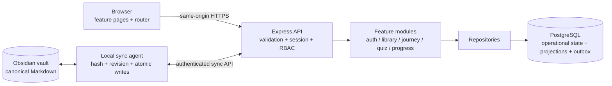

# Prepify Full Overhaul — Architecture Design

**Status:** Approved by user  
**Date:** 2026-09-12  
**Scope:** Rebuild the current foundation before adding new product features

## 1. Outcome

Prepify becomes a small, secure modular monolith with explicit module boundaries,
server-owned authentication and scoring, an Obsidian projection/outbox boundary,
and one enforced quality gate for humans and coding agents.

This is a foundation rewrite, not a visual redesign and not a move to
microservices.

## 2. Requirements

### Functional

- Preserve Home, login/logout, Library, Journey, Quiz, progress and VI/EN flows.
- Keep Library and Journey private to the admin account.
- Keep Obsidian as the canonical source for Daily, Journey and knowledge notes.
- Support safe browser access without exposing the local vault.
- Make every current user flow testable without starting the server manually.

### Non-functional

- No authentication credential is readable by browser JavaScript.
- No real private corpus is shipped in a frontend bundle or tracked as an app
  fixture.
- Authorization is enforced by the server for every protected resource.
- Applied migrations are append-only and forward-compatible.
- Local and CI verification use the same command.
- The structure stays understandable for one developer and multiple coding
  agents.

## 3. High-level architecture



### Deployment shape

- One frontend build served from the same origin as the API.
- One Express process.
- One PostgreSQL database.
- One optional local sync agent running only on a trusted machine that can see
  the vault.
- No direct production-server filesystem access to Obsidian.

This avoids microservice overhead while retaining boundaries that can be split
later if real scale requires it.

## 4. Code boundaries

### Frontend

```text
src/
  app/
    bootstrap.ts
    router.ts
    routes.ts
  features/
    auth/
    home/
    library/
    journey/
    quiz/
    progress/
  shared/
    api/
    i18n/
    security/
    ui/
    validation/
  styles/
```

Rules:

- `app/` composes features; it contains no business rules.
- A feature does not import another feature's internal files.
- Shared code must be product-agnostic and earn its place through reuse.
- DOM content uses `textContent` or a centralized sanitizer; feature code may
  not build untrusted `innerHTML`.
- Authentication state comes from `/api/auth/session`, never from
  `localStorage`.

### Backend

```text
server/src/
  app.ts
  index.ts
  config/
  middleware/
  modules/
    auth/
    library/
    journey/
    quiz/
    progress/
    sync/
  platform/
    clock/
    crypto/
    database/
    logger/
    mail/
  shared/
    errors/
    http/
    validation/
```

Each feature module follows:

```text
route -> input schema -> service/domain -> repository -> PostgreSQL
```

Rules:

- `index.ts` only loads validated configuration, creates dependencies, starts
  the server and performs graceful shutdown.
- `app.ts` is a pure Express factory and never listens on a port.
- Routes do not read SQL, files or `process.env` directly.
- Services own use cases and transactions.
- Repositories own persistence details.
- Time, randomness, email and hashing are injected platform interfaces so tests
  can control them.

## 5. Authentication and security

### Session model

JWT in URLs and `localStorage` is removed. Prepify uses opaque server sessions:

1. Server creates a cryptographically random 256-bit token.
2. Browser receives it only in a cookie with `HttpOnly`, `Secure`,
   `SameSite=Lax` and an explicit expiry.
3. PostgreSQL stores only a hash of the token.
4. Logout, password reset and role-sensitive events revoke sessions.
5. Expired and revoked sessions are rejected and cleaned up safely.

State-changing requests require same-origin validation and CSRF protection
where the cookie/SameSite boundary is insufficient.

### Password login and reset

- Normalize email and validate request schemas before service execution.
- Apply per-IP and per-account rate limiting.
- Keep bcrypt verification and prevent observable account-enumeration
  differences.
- Password-reset requests always return the same external response.
- Reset tokens are random, short-lived, single-use and stored only as hashes.
- Security-question recovery is removed; it is weak knowledge-based
  authentication and creates a brute-force surface.

### OAuth

- Use authorization code + PKCE and a browser-bound signed state value.
- Accept the callback once, then create the normal server session.
- Never put credentials in a redirect URL.
- Auto-link only when the provider asserts a verified email; otherwise require
  an already authenticated explicit linking flow.

### Browser safety

- Add a restrictive Content Security Policy and security headers.
- Remove unsafe unescaped HTML construction.
- Run user code in an isolated Web Worker with a hard timeout and termination.
- The worker receives only the code/test payload; it cannot access auth state,
  DOM or application services.

### Authorization

Every protected endpoint applies a server-side matrix:

| Resource | Anonymous | User | Admin |
|---|---:|---:|---:|
| Home/public feed shell | Read | Read | Read |
| Own session/progress | Deny | Own data | Own data |
| Library projection | Deny | Deny | Read |
| Journey projection/mutation | Deny | Deny | Read/write |
| Sync API | Deny | Deny | Trusted sync credential only |

The frontend route guard improves UX but is never an authorization control.

## 6. Data ownership and Obsidian integration

| Data | System of record | App read model | Write path |
|---|---|---|---|
| Users, roles, sessions | PostgreSQL | PostgreSQL | API transaction |
| Quiz attempts, progress, streak | PostgreSQL | PostgreSQL | Server computes result |
| Theory and Library Markdown | Obsidian | PostgreSQL projection | Local sync publishes |
| Journey/Daily answers | Obsidian after sync | Projection + sync state | API outbox -> local sync -> vault |
| VI/EN content contract | Obsidian/content source | Locale projection | Schema-validated sync |

### Projection flow

1. The local agent reads only allowlisted vault paths.
2. It parses and validates frontmatter/content structure.
3. It computes a content hash and source revision.
4. It upserts the database projection idempotently.
5. It records a redacted audit event.

The app reads the projection. It never treats the projection as the canonical
editable note.

### Journey mutation flow

1. Browser submits structured input, idempotency key and expected revision.
2. API validates session, admin role and schema.
3. One database transaction stores the durable mutation/outbox record.
4. The local agent claims the mutation and performs an atomic Markdown write.
5. A revision mismatch becomes a visible conflict; the agent never overwrites
   newer vault content.
6. Successful application publishes the new projection and marks the mutation
   complete.

### Privacy boundary

- Real personal content lives outside the application repository.
- The repository keeps only synthetic test fixtures.
- The production frontend never imports private content files.
- Existing public Git history exposure is a separate release decision; no
  destructive history rewrite or GitHub visibility change is automatic.

## 7. Core data model

New schema changes are append-only migrations.

| Table | Responsibility | Important constraints |
|---|---|---|
| `sessions` | Revocable browser sessions | unique `token_hash`, user FK, expiry, revocation |
| `password_reset_tokens` | One-time recovery | unique `token_hash`, expiry, `consumed_at` |
| `content_projections` | App-readable Obsidian projection | unique source path + locale, hash, revision |
| `journey_mutations` | Durable vault-write outbox | unique idempotency key, expected revision, status |
| `quiz_attempts` | Verified learning attempts | user FK, answer snapshot, server-computed score |
| `audit_events` | Security and sync trail | actor, action, subject, redacted metadata |

Existing tables are migrated rather than rewritten in place. Database
constraints enforce uniqueness, ownership and valid state transitions where
possible.

## 8. API conventions

- Versioned base path: `/api/v1`.
- JSON request/response schemas are validated at the boundary.
- Error envelope:

```json
{
  "error": {
    "code": "AUTH_INVALID_CREDENTIALS",
    "message": "Unable to sign in",
    "requestId": "..."
  }
}
```

- Internal exceptions, SQL errors and secrets never reach clients.
- Mutation endpoints support idempotency where retries can duplicate work.
- Pagination is cursor-based for growing collections.
- Server derives identity from the session and never trusts a client-supplied
  user ID, score, role or completion state.

## 9. Error handling and operations

- Typed environment configuration fails fast before opening the server port.
- Structured logs include request ID and redacted actor/context.
- Health endpoints distinguish process liveness from database readiness.
- Graceful shutdown stops new requests, drains active work and closes the pool.
- External operations have explicit timeout and retry policy.
- Retry only idempotent operations; terminal sync conflicts require user review.

Initial scale assumptions are one owner/admin, low request volume and one local
sync worker. PostgreSQL and a single application process are sufficient.
Horizontal scaling remains possible because session and mutation state are in
PostgreSQL rather than process memory.

## 10. Testing strategy

`npm run check` is the single local and CI definition of green:

1. formatting check;
2. ESLint and module-boundary rules;
3. frontend and backend typecheck;
4. unit tests;
5. API integration tests against a disposable database;
6. frontend DOM/component tests;
7. production builds;
8. bundle privacy scan;
9. migration test from empty and previous schema;
10. production dependency audit and secret scan.

Critical E2E journeys:

- password login -> authenticated session -> logout;
- OAuth login without URL/storage token leakage;
- anonymous/user/admin access matrix;
- admin opens Library in both locales;
- admin opens Journey, submits an answer and sees sync state;
- revision conflict does not overwrite the vault;
- quiz submission is scored by the server;
- password-reset token cannot be enumerated, replayed or reused;
- malicious content cannot execute script;
- infinite user code is terminated without freezing the app.

Every implementation task follows red-green-refactor. Characterization tests
are written before changing existing behavior.

## 11. Agent and repository workflow

The repository keeps one small `AGENTS.md` router. It references installed
Superpowers skills rather than copying their workflow.

Mandatory development sequence:

```text
brainstorm -> approved spec -> written plan -> isolated branch/worktree
-> failing test -> minimal implementation -> task review
-> full verification -> release checklist -> user review
```

- Small commits describe one coherent change.
- Dirty user changes are inventoried and preserved.
- No agent pushes without an explicit user instruction.
- New features must name their module, owner, API/data contract, security
  boundary and tests in the approved spec before implementation.

## 12. Migration plan

The app stays runnable after each phase.

1. **Baseline:** add characterization tests for current flows and inventory the
   existing dirty worktree.
2. **Toolchain:** add workspace scripts, formatter, lint, test harness and CI;
   establish `npm run check`.
3. **Server shell:** introduce typed config, app factory, common errors/logging
   and graceful shutdown.
4. **Identity:** migrate to database sessions; repair OAuth/reset/rate limiting;
   enforce the RBAC matrix; remove security questions.
5. **Data integrity:** move scoring/streak/date rules server-side and behind
   services/repositories.
6. **Frontend shell:** migrate routing, API client, i18n, auth state and safe DOM
   rendering into the new feature structure.
7. **Obsidian boundary:** implement projections, durable mutation outbox and the
   local sync agent.
8. **Code sandbox:** replace same-page `new Function` execution with a
   disposable worker and timeout.
9. **Release:** run dependency remediation, complete E2E/security regression,
   rehearse migrations, update documentation and perform a manual UX pass.

During the session migration, legacy JWTs may be accepted only through a short,
explicit compatibility adapter with a removal test/date. Rollback never rewrites
an applied migration or deletes user data.

## 13. Trade-offs and rejected alternatives

### Chosen: modular monolith

It gives strong code boundaries and one deployable unit. Microservices would add
network failure modes, distributed tracing and deployment cost without a scale
requirement.

### Chosen: opaque database sessions

They are revocable and invisible to browser JavaScript. Compared with stateless
JWTs, they add one indexed database lookup per authenticated request, which is
acceptable at Prepify's scale.

### Chosen: Obsidian canonical + database projection/outbox

It preserves the vault workflow and supports remote browser access. Direct
server filesystem access would expose the vault boundary; making PostgreSQL the
canonical note editor would fight the user's established Obsidian workflow.

### Rejected: rewrite everything before running tests

The codebase is small, but a big-bang rewrite would still erase working behavior
and make regressions hard to locate. Vertical migration provides the same clean
destination with reversible checkpoints.

## 14. Release gates

The overhaul is ready for the user's Git review only when:

- `npm run check` passes from a clean install;
- critical E2E and security cases pass;
- no private corpus appears in the frontend bundle or tracked real fixtures;
- no production dependency has an unexplained high/critical advisory;
- migrations pass on empty and upgraded databases;
- the manual login, locale, Library, Journey and Quiz review passes;
- README, environment template, ADRs and agent instructions match reality;
- `git diff` contains no unrelated or accidental file changes;
- nothing has been pushed by the agent.

## 15. Revisit when growth proves the need

- Split the sync worker into a managed service only when multiple vault devices
  or sustained queue volume appear.
- Add Redis only when measured database/session/rate-limit load requires it.
- Split services only when teams or independent deployment needs outweigh the
  operational cost.
- Add object storage/search indexing only when projection size or search quality
  exceeds PostgreSQL capabilities.
